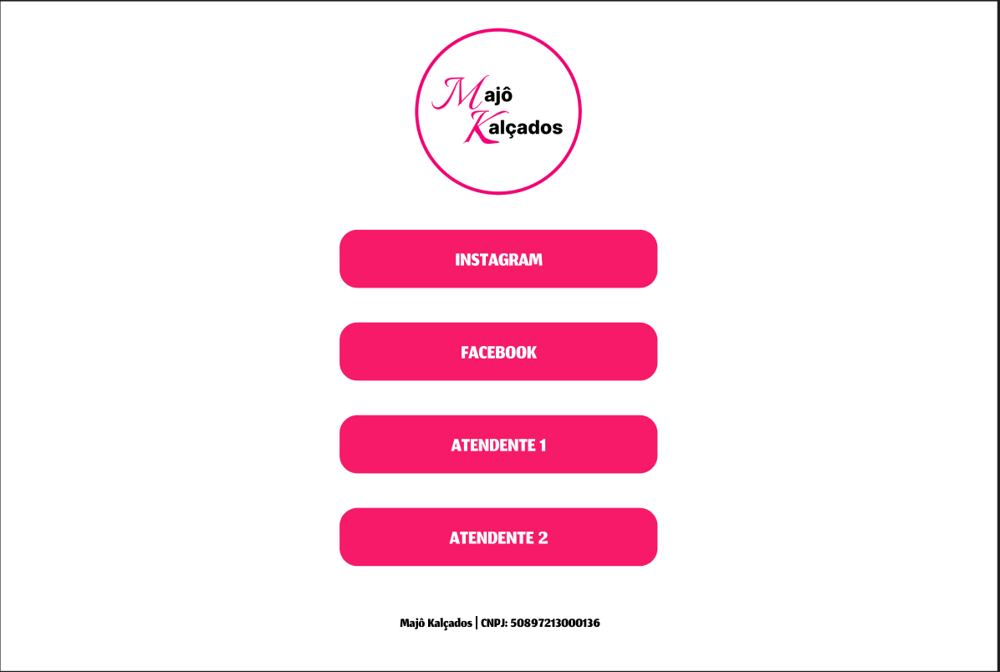

<h1 align="center"> MAJÔ KALÇADOS</h1>

Social-Linking da Loja Majô Kalçados 

https://curtlink.com/33b

  <a href="#-tecnologias">Tecnologias</a>&nbsp;&nbsp;&nbsp;|&nbsp;&nbsp;&nbsp;
  <a href="#-projeto">Projeto</a>&nbsp;&nbsp;&nbsp;|&nbsp;&nbsp;&nbsp;
  <a href="#-layout">Layout</a>&nbsp;&nbsp;&nbsp;|&nbsp;&nbsp;&nbsp;
  <a href="#memo-licença">Licença</a>

  

 

  

## 🚀 Tecnologias

Esse projeto foi desenvolvido com as seguintes tecnologias:

- HTML e CSS
- Git e Github
- Figma

  

## 💻 Projeto

Esse projeto foi feito para suprir as necessidades da loja virtual Majô Kalçados,que era centralizar os principais links da loja.

## 🔖 Layout

Você pode visualizar o layout do projeto através [DESSE LINK](https://www.figma.com/file/dEvzRPlawmVaoasdIeeTSc/Untitled?type=design&node-id=0%3A1&mode=design&t=sBg7lTwWUGgiTxI9-1). É necessário ter conta no [Figma](https://figma.com) para acessá-lo.

## :memo: Licença

Esse projeto está sob a licença MIT.

---

Feito com ♥ by Matheus 
